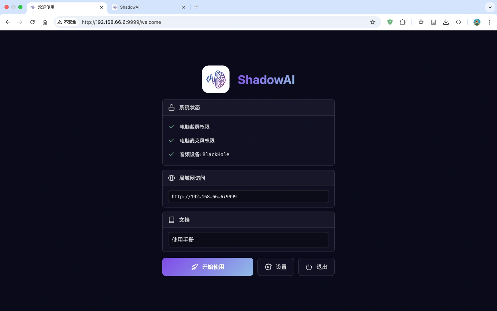
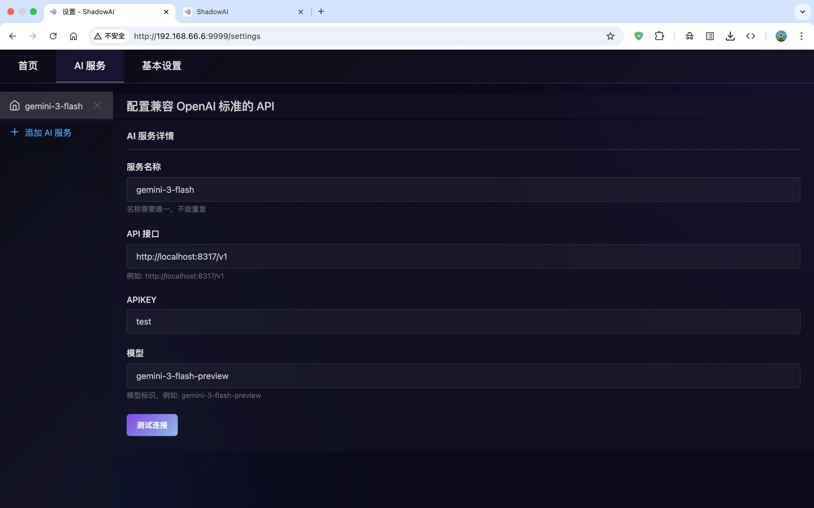
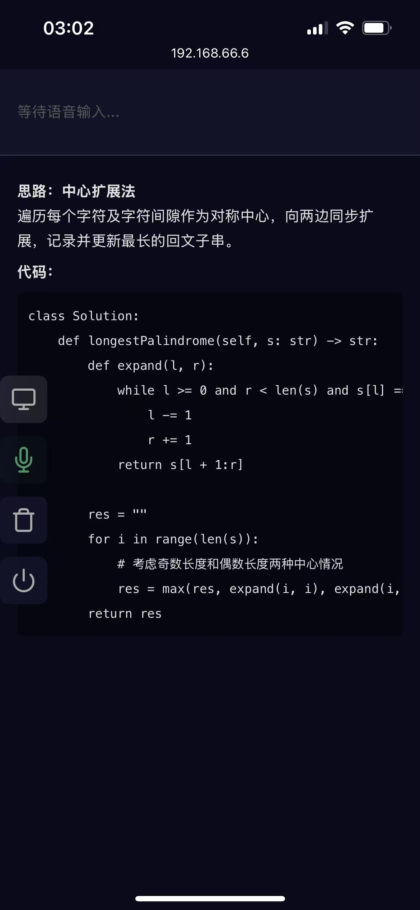

# Shadow AI「影子 AI」

### 无痕无感的 AI 工具，可以在「受控设备/受限环境」使用 AI, 极速且高效且稳定

## 系统依赖

<details><summary>MacOS</summary>

```text
1. 语音识别 STT 模型, 下载并解压
https://github.com/k2-fsa/sherpa-onnx/releases/download/asr-models/sherpa-onnx-streaming-zipformer-zh-2025-06-30.tar.bz2

2. 音频驱动 BlackHole: Audio Loopback Driver, 安装默认的 blackhole-2ch 即可
https://github.com/ExistentialAudio/BlackHole?tab=readme-ov-file#option-1-download-installer

打开「音频 MIDI 设置」-> 创建「多输出设备」，勾选内建输出 + BlackHole 2ch -> 右键将「多输出设备」用于声音输出
```

</details>

<details><summary>Windows</summary>

```text
1. 语音识别 STT 模型, 下载并解压
https://github.com/k2-fsa/sherpa-onnx/releases/download/asr-models/sherpa-onnx-streaming-zipformer-zh-2025-06-30.tar.bz2
```

</details>

## 功能介绍

1. 启动后, 会自动在浏览器中打开引导页
   

2. 可以添加自定义 AI 服务, 默认模型, 自定义的提示词等。其中需要注意配置「语音识别」，需填写「前面解压得到的 STT
   模型路径」例如:

```text
/Users/david/Downloads/models/sherpa-onnx-streaming-zipformer-zh-2025-06-30
```

   

3. 功能页说明

```text
1. 语音识别区: 应用会使用模型实时识别音频里的语音, 并在这里实时更新字幕
2. AI 回答区: 返回模型的回答（当你在设置中选择多个模型时, 使用最快响应的回答）
3. 按钮说明: 
  3.1 截屏分析, 点击会截取设备当前屏幕, 提交给 AI 获取回答
  3.2 语音分析, 点击会提交当前语音转写文本「作为问题」, 提交给 AI 获取回答, 注意: 提交缓存的所有的语音转写文本
  3.3 语音文本重置, 点击之后清理语音转写文本缓存
  3.4 程序退出
```

   

