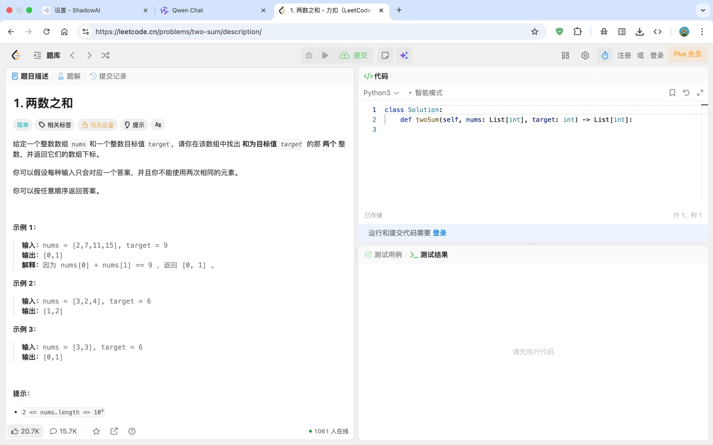
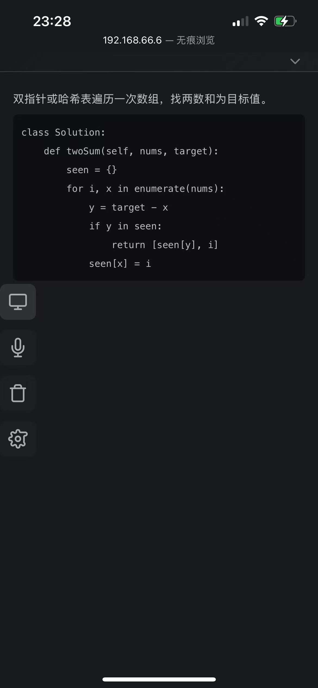
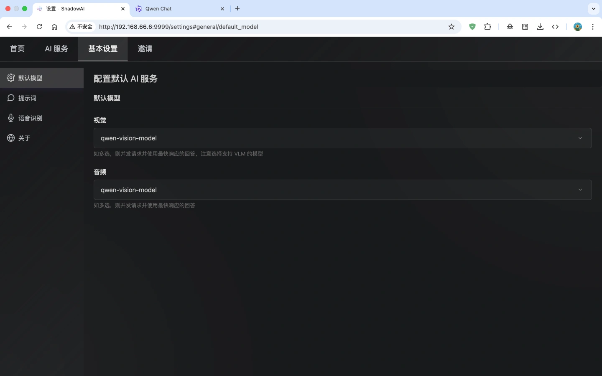
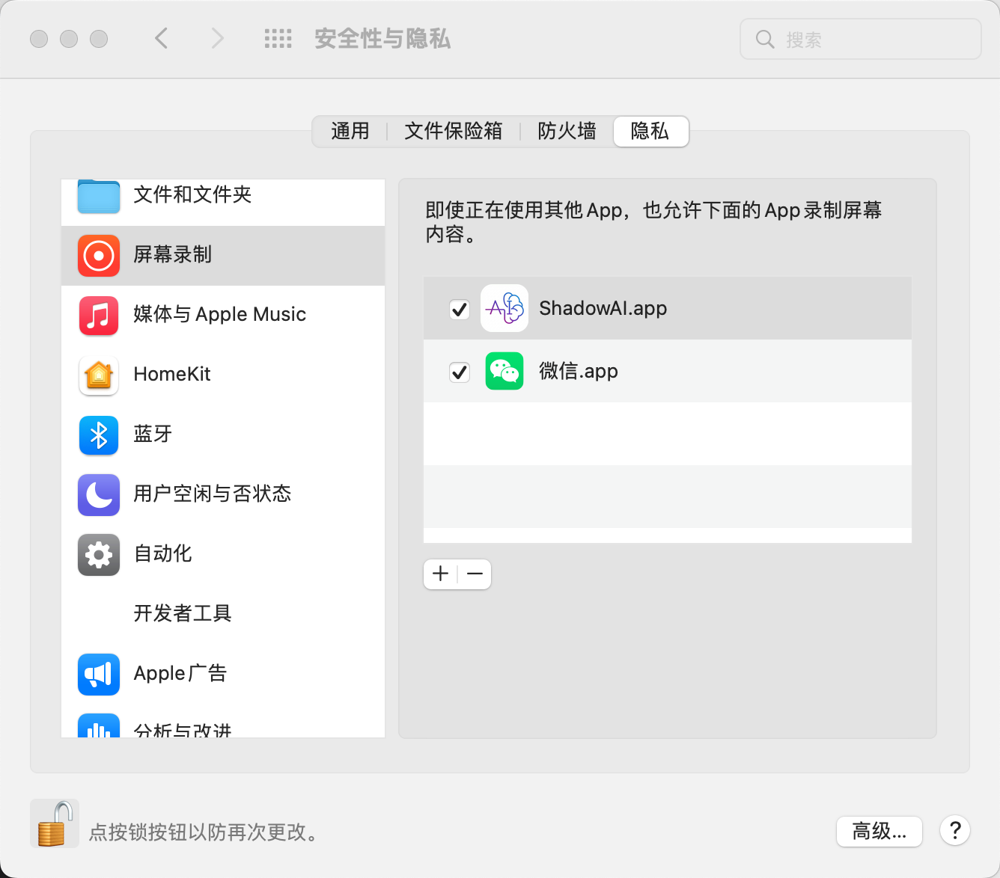

<h1>Shadow AI: Designed for Restricted Environments</h1>
  

    
    
  

[中文](README_ZH.md) | **English**

## Features

Shadow AI is an AI assistant designed specifically for restricted environments. It provides a stealthy operation mode
without windows or traces, and enables cross-device AI Q&A interaction and control via the local area network (LAN).

Essentially, it is an automated collaboration layer of "screen/audio capture + AI inference + low-friction delivery",
helping users to immersively use AI assistants across applications on controlled devices or in restricted environments.

- **Stealth Operation**: Supports silent background operation on target devices with no frontend window.
- **Cross-Platform Control**: Supports remote takeover and control via LAN using devices like smartphones or tablets.
- **Standard Interface**: Compatible with standard OpenAI API specifications for third-party integration.
- **Major AI Services: Support "Qwen, OpenAI, Claude, Gemini, Antigravity, Kimi", FAST and STABLE.**
- **Concurrency & Routing**: Supports multiple accounts and concurrent requests.

## Interface

|  |  |
|----------------------------------------------------------------------------------------------------------|---------------------------------------------------------------------------------------------|

<strong>AI Settings</strong>

**Multi-Channel Support** Supports AI tools like "Qwen, OpenAI, Claude, Gemini, Antigravity, Kimi" as backend large
models.

**Test Models** Click to add a model to custom AI, then test whether the model is working properly.

**Switch Models** You can specify different models for visual (screenshot analysis) and audio (voice Q&A). Selecting
multiple models enables concurrent queries, displaying the fastest response.

**Prompts** Set system prompts tailored to your custom application scenarios.

## Feedback & Community

This project is under iterative development. If you have any **bug reports, feature requests, or usage questions**,
please feel free to join our group and provide feedback.

<strong>Telegram</strong>

https://t.me/shadow_ai_group

## FAQ

<strong>Windows</strong>

1. The program is installation-free; Just extract it and use it.
2. How to enable speech recognition analysis? (Optional)
    * Download and extract the STT model, then configure the speech recognition model path in Settings.
    * STT Model URL
      `https://github.com/k2-fsa/sherpa-onnx/releases/download/asr-models/sherpa-onnx-streaming-zipformer-zh-2025-06-30.tar.bz2`
    * How to verify?
        * Play an audio clip. The speech recognition panel should transcribe subtitles in real time.
        * Note: Speech recognition analyzes the `system audio output (speaker playback)`, not the
          `microphone input (recording)`.

<strong>MacOS</strong>

1. How to enable screenshot analysis?
    * Permission Check: Settings → Privacy & Security → Screen Recording: Allow this application.
    * Restart the software after granting permission.
      
2. How to enable speech recognition analysis? (Optional)
    1. MacOS Audio Configuration
        1. Install [BlackHole](https://github.com/ExistentialAudio/BlackHole).
        2. Open "Audio MIDI Setup".
        3. Create a "Multi-Output Device" and check "Built-in Output" + "BlackHole 2ch".
        4. Set the Multi-Output Device as the default system output.
    2. STT Model Configuration
        * Download and extract the STT model, then configure the speech recognition model path in Settings.
        * STT Model URL
          `https://github.com/k2-fsa/sherpa-onnx/releases/download/asr-models/sherpa-onnx-streaming-zipformer-zh-2025-06-30.tar.bz2`
    3. How to verify?
        * Play an audio clip. The speech recognition panel should transcribe subtitles in real time.
        * Note: Speech recognition analyzes the `system audio output (speaker playback)`, not the
          `microphone input (recording)`.

## Disclaimer

This project is intended for technical communication and learning purposes only. Please use this software in strict
compliance with local laws and regulations, institutional rules, and platform agreements. The user bears full
responsibility for any legal violations, disciplinary actions, and legal disputes arising from the misuse of this
project. The developers assume no direct or indirect responsibility.
