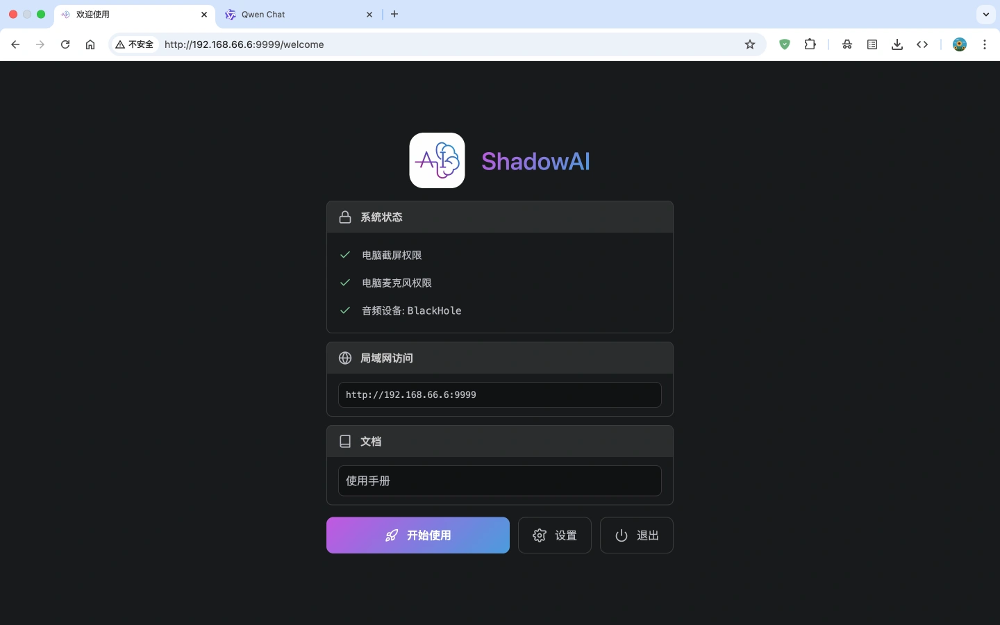
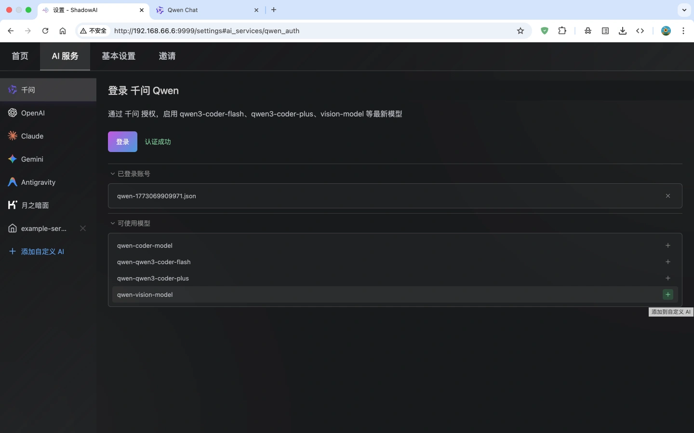
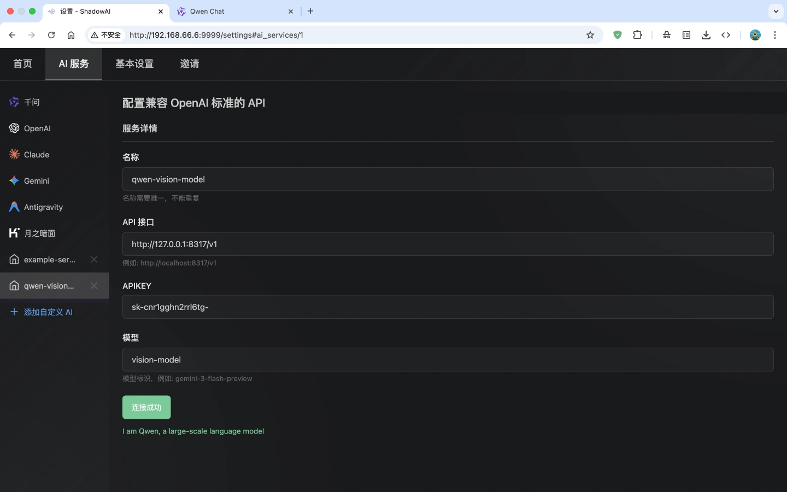
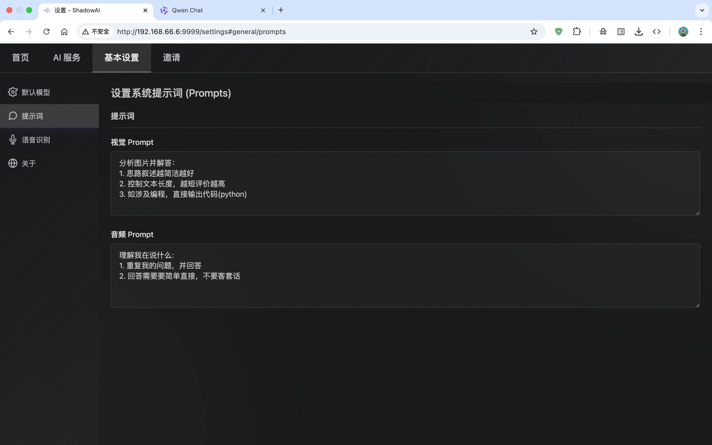

# Shadow AI

Shadow AI 是一款专为受限定环境设计的 AI 辅助工具。提供无窗口、无痕迹的隐蔽运行方式，并通过局域网实现跨设备的 AI
问答交互与控制。

## 特性

- **隐蔽运行**：支持目标设备后台静默运行，无前端窗口
- **跨端操作**：通过局域网，支持手机或平板等设备远程接管控制
- **标准接口**：兼容标准 OpenAI API 规范的第三方接入
- **大厂 AI 服务：支持「千问、OpenAI、Claude、Gemini、Antigravity、Kimi」登录，极速稳定**
- **并发与路由**：支持多账号与并发

## 界面

**功能页**

|  |  |
|-------------------------------------------------|------------------------------------------------|

<strong>AI 配置</strong>

支持「千问、OpenAI、Claude、Gemini、Antigravity、Kimi」等多种 AI 工具作为后端大模型

登录成功后，可快速添加模型到自定义 AI 中，然后测试是否正常工作

**切换模型：**可以为视觉（截图分析）、音频（语音问答）指定不同的模型，多选则并发提问，然后显示最快的回答

#### 提示词配置

结合自定义应用场景，设置系统提示词

## 常见问题

1. 授予权限后需要重启才会生效

## 免责声明

本项目仅供技术交流与学习使用。请在严格遵守当地法律法规、机构规章及平台协议的前提下使用本软件。因滥用本项目产生的违规违法行为、纪律处分及法律纠纷，由使用者本人承担全部责任，开发者不承担任何直接或间接责任。